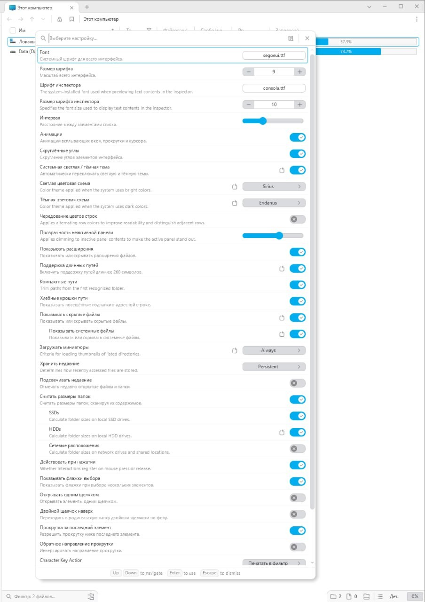

# File Pilot Russian Localization

Unofficial Russian localization files and an experimental local patcher for [File Pilot](https://filepilot.tech/).

File Pilot is a fast Windows file manager by Voidstar. As of File Pilot `0.7.0`, the app does not appear to load third-party language files directly. The localization in this repository is therefore provided in two forms:

- `FilePilot.ru-RU.language.json` - an external Russian dictionary for review, reuse, or future official localization support.
- `tools/apply_ru_patch.py` - an experimental patcher that applies selected Russian strings to your own local copy of `FPilot.exe`.

This repository does not include File Pilot itself and does not redistribute any File Pilot binaries.



## Status

- Target app version: File Pilot `0.7.0` beta.
- Language: Russian (`ru-RU`).
- Translation state: partial, focused on visible UI strings.
- The dictionary contains manually translated strings and English fallback strings.
- The patcher intentionally skips some internal identifiers and command strings to reduce the chance of breaking app behavior.

## Installation

### Option 1: Keep the dictionary only

Download `FilePilot.ru-RU.language.json` and keep it as a reference language file.

At the moment, File Pilot `0.7.0` does not appear to load this file directly, so placing it next to the app may not change the UI.

### Option 2: Apply the experimental local patch

Close File Pilot first.

Run PowerShell from this repository folder:

```powershell
py .\tools\apply_ru_patch.py --exe "$env:LOCALAPPDATA\Voidstar\FilePilot\FPilot.exe"
```

If Python is not available as `py`, use your Python executable directly:

```powershell
python .\tools\apply_ru_patch.py --exe "$env:LOCALAPPDATA\Voidstar\FilePilot\FPilot.exe"
```

The script will:

1. create a backup under `backups/`;
2. add a `.rulang` section to your local `FPilot.exe`;
3. redirect selected visible UI strings to Russian translations;
4. print a short report with the number of applied and skipped replacements.

## Restore

To restore the original executable, copy the backup file created by the patcher back over `FPilot.exe`.

Example:

```powershell
Copy-Item ".\backups\filepilot-ru-backup-YYYYMMDD-HHMMSS\FPilot.exe" "$env:LOCALAPPDATA\Voidstar\FilePilot\FPilot.exe" -Force
```

You can also reinstall File Pilot from the official download page.

## Warnings

- This is an unofficial fan-made localization.
- It is not affiliated with File Pilot, Voidstar, or the File Pilot developer.
- The patcher modifies your local executable. Use it at your own risk.
- File Pilot updates may overwrite the patch.
- The patcher is designed for File Pilot `0.7.0`; other versions may apply fewer strings or fail.
- Do not distribute patched File Pilot executables.

## Original Project

- Official website: <https://filepilot.tech/>
- Download page: <https://filepilot.tech/download>
- Handmade Network project page: <https://filepilot.handmade.network/>

I could not find a public source repository for File Pilot at the time this package was prepared. If an official repository exists, please open an issue or pull request and it can be linked here.

## About This Translation

The Russian translation, packaging, publication notes, and installation instructions were prepared with the help of Codex.

Please review the strings before relying on them in a production or work-critical setup.

## Keywords

File Pilot, FilePilot, FPilot, Russian localization, ru-RU, Russian language pack, Windows file manager, Voidstar File Pilot, unofficial translation.
